# 金属和合金的腐蚀 奥氏体及铁素体-奥氏体(双相)不锈钢晶间腐蚀试验方法

# Corrosion of metals and alloys—Test methods for intergranular corrosion of austenitic and ferritic-austenitic (duplex) stainless steels

[ISO 3651-1:1998, Determination of resistance to intergranular corrosion of stainless steels—Part 1: Austenitic and ferritic-austenitic (duplex) stainless steels—Corrosion test in nitric acid medium by measurement of loss in mass (Huey test); ISO 3651-2:1998, Determination of resistance to intergranular corrosion of stainless steels—Part 2: Ferritic, austenitic and ferritic-austenitic (duplex) stainless steels—Corrosion test in media containing sulfuric acid, MOD]

2020-04-28 发布

2020-11-01 实施

# 前言

本标准按照GB/T1.1—2009给出的规则起草。

本标准代替GB/T4334—2008《金属和合金的腐蚀 不锈钢晶间腐蚀试验方法》。本标准与GB/T4334—2008相比，主要技术变化如下：

将标准名称“金属和合金的腐蚀 不锈钢晶间腐蚀试验方法”更改为“金属和合金的腐蚀奥氏体及铁素体-奥氏体(双相)不锈钢晶间腐蚀试验方法；  
——对取样方法和尺寸进行了调整（见3.1，2008年版第3章）；  
——对敏化处理制度进行了调整（见3.2，2008年版第3章）；  
对各试验方法的试验报告内容进行了调整（见第4章、第5章、第6章、第7章、第8章，2008年版第4章、第5章、第6章、第8章）；  
——废除了方法D 不锈钢硝酸-氢氟酸腐蚀试验方法(见2008年版第7章)；  
——方法E名称变更为“铜-硫酸铜-16%硫酸腐蚀试验方法”（见第7章，2008年版第8章）；  
——对方法E的弯曲参数进行了变更(见第7章，2008年版第8章)；  
——增加了方法F铜-硫酸铜 $-35\%$ 硫酸腐蚀试验方法（见第8章）；  
——增加了方法G $40\%$ 硫酸-硫酸铁腐蚀试验方法（见第9章）；  
——增加了对各种方法及其特点的说明（见附录C）；  
——增加了方法E、方法F、方法G的适用范围（见附录D）。

本标准使用重新起草法修改采用ISO3651-1：1998《不锈钢耐晶间腐蚀的测定第1部分：奥氏体及铁素体-奥氏体(双相)不锈钢含硝酸介质中的腐蚀试验》和ISO3651-2：1998《不锈钢耐晶间腐蚀的测定第2部分：铁素体、奥氏体及铁素体-奥氏体(双相)不锈钢含硫酸介质中的腐蚀试验》。

本标准与ISO3651-1:1998和ISO3651-2:1998相比在结构上有较多调整，附录A中列出了本标准与ISO3651-1:1998和ISO3651-2:1998的章条编号对照一览表。

本标准与ISO3651-1：1998和ISO3651-2：1998相比存在技术性差异，这些差异涉及的条款已通过在其外侧页边空白位置的垂直单线（|）进行了标识，附录B给出了相应技术处差异及原因的一览表。

本标准由中国钢铁工业协会提出。

本标准由全国钢标准化技术委员会(SAC/TC183)归口。

本标准起草单位：钢铁研究总院、山西太钢不锈钢股份有限公司、冶金工业信息标准研究院、安工腐蚀检测实验室科技(无锡)有限公司、酒泉钢铁(集团)有限责任公司、江苏申源集团有限公司、鞍钢股份有限公司、中冶检测认证有限公司。

本标准主要起草人：朱玉亮、丰涵、冯超、李吉东、侯捷、薛俊鹏、刘森、翟健红、李倩、武裕民、宋志刚、任永秀、路民旭、惠恺、李风、贾元伟、林春来。

本标准所代替标准的历次版本发布情况为：

—GB/T4334.1～GB/T4334.5—1984，GB/T4334.1～GB/T4334.5—2000；   
—GB/T4334—2008。

# 金属和合金的腐蚀 奥氏体及铁素体-奥氏体（双相）不锈钢晶间腐蚀试验方法

# 1 范围

本标准规定了奥氏体及铁素体-奥氏体(双相)不锈钢晶间腐蚀试验方法的试样、试验溶液、试验仪器和设备、试验条件和步骤、试验结果评定及试验报告等内容。

本标准适用于检验奥氏体不锈钢及铁素体-奥氏体双相不锈钢（以下简称双相不锈钢）的晶间腐蚀倾向。包括以下试验方法：

# a）方法A： $10\%$ 草酸浸蚀试验方法

检验奥氏体不锈钢晶间腐蚀的筛选试验，试样在 $10\%$ 草酸溶液中电解浸蚀后，在显微镜下观察被浸蚀表面的金相组织，以判定是否需要进行方法B、方法C、方法E等长时间热酸试验。在不允许破坏被测结构件和设备的情况下，也可以作为独立的晶间腐蚀检验方法。

# b）方法B： $50\%$ 硫酸-硫酸铁腐蚀试验方法

将奥氏体不锈钢置于 $50\%$ 硫酸-硫酸铁溶液中经煮沸试验后，以腐蚀速率评定晶间腐蚀倾向。

# c）方法C： $65\%$ 硝酸腐蚀试验方法

将奥氏体不锈钢置于 $65\%$ 硝酸溶液中经煮沸试验后，以腐蚀速率评定晶间腐蚀倾向。

# d）方法E：铜-硫酸铜- $16\%$ 硫酸腐蚀试验方法

将奥氏体不锈钢、双相不锈钢置于铜-硫酸铜- $16\%$ 硫酸溶液中经煮沸试验后，用弯曲法或金相法判定晶间腐蚀倾向。

# e）方法F：铜-硫酸铜 $-35\%$ 硫酸腐蚀试验方法

将奥氏体不锈钢、双相不锈钢置于铜-硫酸铜- $35\%$ 硫酸溶液中经煮沸试验后，用弯曲法或金相法判定晶间腐蚀倾向。

# f）方法 $\mathrm{G}:40\%$ 硫酸-硫酸铁腐蚀试验方法

将奥氏体不锈钢、双相不锈钢置于 $40\%$ 硫酸-硫酸铁溶液中经煮沸试验后，用弯曲法或金相法判定晶间腐蚀倾向。

本标准的附录C以表格形式给出了各试验方法的特点，附录D给出了方法E、方法F、方法G的应用实例。

本标准中各试验方法不适用于用来预测不锈钢在其他介质条件下的抗晶间腐蚀性能，也不适用于预测不锈钢对其他腐蚀形式（如点蚀、均匀腐蚀、应力腐蚀等）的耐蚀性能。

# 2 规范性引用文件

下列文件对于本文件的应用是必不可少的。凡是注日期的引用文件，仅注日期的版本适用于本文件。凡是不注日期的引用文件，其最新版本(包括所有的修改单)适用于本文件。

GB/T625化学试剂 硫酸(GB/T625—2007，ISO6353-2：1983，NEQ)

GB/T626化学试剂 硝酸(GB/T626—2006，ISO6353-2：1983，NEQ)

GB/T655 化学试剂 过硫酸铵

GB/T665化学试剂无水合硫酸铜（Ⅱ）（硫酸铜）(GB/T665—2007，ISO6353-2：1983，NEQ)

GB/T2100 通用耐蚀钢铸件(GB/T2100—2017,ISO11972:2015,MOD)

GB/T8170 数值修约规则与极限数值的表示和判定

GB/T9854化学试剂二水合草酸(草酸)(GB/T9854—2008,ISO6353-2:1983,NEQ)

# 3 试样

# 3.1 取样及制备

3.1.1 压力加工钢材的试样从同一炉号、同一规格和同一热处理批次的钢材中取样。  
3.1.2 铸件试样按GB/T2100规定，从同一炉号钢水浇注的试块中取样。含稳定化元素钛的钢种，在该炉号最末浇注的试块中取样。  
3.1.3 焊管试样从同一炉号、同一规格和同一热处理批次的焊管中取样。  
3.1.4 焊接试样从与产品钢材相同且焊接工艺也相同的试块上取样。   
3.1.5 试样表面宜接近产品原始表面状态。对于有焊接接头的试样应尽可能包括母材、热影响区以及焊接金属的表面。用方法A判定凹坑组织时应检验断面。方法B、方法C试样尺寸及制备要求见表1，单个试样总表面积应不小于 $5\mathrm{cm}^2$ ，方法E、方法F、方法G试样尺寸及制备要求见表2。  
3.1.6 试样采用机加工进行切取，如用剪切或其他方法时应通过切削或研磨的方法除去剪切的影响部分。  
3.1.7 方法A试样被检查的表面应抛光，以便进行腐蚀和显微组织检验。  
3.1.8 方法B、方法C、方法E、方法F、方法G试样上有氧化皮时，要通过切削或研磨的方式除去。需要敏化处理的试样，应在敏化处理后进行研磨。不能进行研磨的试样，可以进行酸洗，表面不能过酸洗。不能进行研磨或酸洗处理的试样，热处理时，表面不能氧化。  
3.1.9 方法B、方法C、方法E、方法F、方法G试样切取及表面磨制过程中应防止表面过热，加工后的试样表面粗糙度 $Ra$ 值一般应不大于 $0.8\mu \mathrm{m}$ 。对无法精磨的试样，根据双方协议也可以采用其他表面粗糙度。

表 1 方法 B、方法 C 试样尺寸及制备要求  

<table><tr><td rowspan="2">类别</td><td rowspan="2">厚度或直径amm</td><td colspan="3">试样尺寸mm</td><td rowspan="2" colspan="2">试样数量个</td><td rowspan="2">说明</td></tr><tr><td>长</td><td>宽</td><td>厚</td></tr><tr><td rowspan="2">钢板、带(扁钢)</td><td>≤3</td><td>30±10</td><td>20±10</td><td>-</td><td colspan="2">2</td><td>沿轧制方向取样</td></tr><tr><td>&gt;3</td><td>30±10</td><td>20±10</td><td>3~4</td><td colspan="2">2</td><td>沿轧制方向取样,一个试样从一面加工到试样厚度,另一个试样从另一面加工到试样厚度</td></tr><tr><td>型钢、锻件</td><td>-</td><td>30±10</td><td>20±10</td><td>3~4</td><td colspan="2">2</td><td>从截面中部沿纵向取样</td></tr><tr><td rowspan="2">钢棒(钢丝)</td><td>≤10</td><td>30±10</td><td>-</td><td>-</td><td colspan="2">2</td><td>-</td></tr><tr><td>&gt;10</td><td>30±10</td><td>≤20</td><td>≤5</td><td colspan="2">2</td><td>从截面中部沿纵向取样</td></tr><tr><td rowspan="4">无缝钢管</td><td>&lt;5</td><td>30±10</td><td>-</td><td>-</td><td colspan="2">2</td><td>取整段管状试样</td></tr><tr><td>5~15</td><td>30±10</td><td>-</td><td>-</td><td colspan="2">2</td><td>取半管状或舟形试样</td></tr><tr><td rowspan="2">&gt;15</td><td rowspan="2">30±10</td><td rowspan="2">≤20</td><td rowspan="2">-</td><td>壁厚&lt;4mm</td><td>2</td><td>-</td></tr><tr><td>壁厚≥4mm</td><td>4</td><td>一组(2个试样)从外壁加工到试样厚度,另一组(2个试样)从内壁加工到试样厚度</td></tr></table>

表 1 (续)  

<table><tr><td rowspan="2">类别</td><td rowspan="2">厚度或直径amm</td><td colspan="3">试样尺寸mm</td><td rowspan="2">试样数量个</td><td rowspan="2">说 明</td></tr><tr><td>长</td><td>宽</td><td>厚</td></tr><tr><td rowspan="2">焊管</td><td>≤3</td><td>30±10</td><td>-</td><td>管壁厚</td><td>2</td><td>取半管状或舟形试样,焊缝沿试样长度方向,位于试样中部,见图1。对于舟形试样,试样母材边缘至熔合线距离,两面均不小于10mm,试样内外表面不进行加工,需敏化处理的试样可在敏化后进行除去氧化膜的表面处理。对大直径管亦可采用弧形试样,数量加倍,焊缝位于弧形试样中央,见图2</td></tr><tr><td>&gt;3</td><td>30±10</td><td>-</td><td>3~4</td><td>4</td><td>管壁厚度不小于4mm时,一组(2个试样)从外壁加工到试样厚度,另一组(2个试样)从内壁加工到试样厚度;其他要求同上</td></tr><tr><td>铸件</td><td>-</td><td>30±10</td><td>≤20</td><td>-</td><td>2</td><td>-</td></tr><tr><td>焊条</td><td>-</td><td>30±10</td><td>10±5</td><td>-</td><td>2</td><td>按图3取焊条试样</td></tr><tr><td>堆焊焊条</td><td>-</td><td>30±10</td><td>-</td><td>-</td><td>2</td><td>按图4取堆焊焊条试样</td></tr><tr><td>焊接接头(单焊缝)</td><td>-</td><td>30±10</td><td>20±10</td><td>3~4</td><td>2</td><td>焊缝位于中部,见图5</td></tr><tr><td>焊接接头(交叉焊缝)</td><td>-</td><td>30±10</td><td>20±10</td><td>3~4</td><td>4</td><td>焊缝交叉点位于试样中部,两个试样检验横焊缝,两个试样检验纵焊缝,见图6</td></tr><tr><td colspan="7">a 对无缝钢管直径指外径。</td></tr></table>

表 2 方法 $\mathbf{E}$ 、方法 $\mathbf{F}$ 、方法 $\mathbf{G}$ 试样尺寸及制备要求  

<table><tr><td rowspan="2">类别</td><td rowspan="2">厚度或直径amm</td><td colspan="3">试样尺寸mm</td><td rowspan="2">试样数量个</td><td rowspan="2">说明</td></tr><tr><td>长</td><td>宽</td><td>厚</td></tr><tr><td rowspan="2">钢板、带(扁钢)</td><td>≤3</td><td>≥50</td><td>20±10</td><td>-</td><td>2</td><td>沿轧制方向取样,试验后每个试样均弯曲两个被检验面</td></tr><tr><td>&gt;3</td><td>≥50</td><td>20±10</td><td>3~4</td><td>4</td><td>沿轧制方向取样,两个试样从一面加工到试样厚度,另外两个试样从另一面加工到试样厚度;试验后各弯曲其相应的一个被检验面</td></tr><tr><td>型钢、锻件</td><td>-</td><td>≥50</td><td>20±10</td><td>3~4</td><td>2</td><td>-</td></tr><tr><td rowspan="2">钢棒(钢丝)</td><td>≤10</td><td>≥50</td><td>-</td><td>-</td><td>2</td><td>-</td></tr><tr><td>&gt;10</td><td>≥50</td><td>≤20</td><td>≤5</td><td>2</td><td>从截面中部沿纵向取样;试验后每个试样均弯曲两个被检验面</td></tr></table>

表 2 (续)  

<table><tr><td rowspan="2">类别</td><td rowspan="2">厚度或直径amm</td><td colspan="3">试样尺寸mm</td><td rowspan="2" colspan="2">试样数量个</td><td rowspan="2">说 明</td></tr><tr><td>长</td><td>宽</td><td>厚</td></tr><tr><td rowspan="4">无缝钢管</td><td>&lt;5</td><td>≥50</td><td>-</td><td>-</td><td colspan="2">2</td><td>取整段管状试样。采用弯曲法评定时内外壁都需检验,如内壁不能弯曲评定时,则用金相法评定;也可以采用压扁法评定</td></tr><tr><td>5~15</td><td>≥50</td><td>-</td><td>-</td><td colspan="2">2</td><td>取半管状或舟形试样,试验后每个试样均弯曲两个被检验面,也可取整管试样用压扁法评定</td></tr><tr><td rowspan="2">&gt;15</td><td rowspan="2">≥50</td><td rowspan="2">≤20</td><td rowspan="2">-</td><td>壁厚&lt;4mm</td><td>2</td><td>-</td></tr><tr><td>壁厚≥4mm</td><td>4</td><td>一组(2个试样)从外壁加工到试样厚度,另一组(2个试样)从内壁加工到试样厚度,试验后各弯曲其相应的被检验面</td></tr><tr><td rowspan="2">焊管</td><td>≤3</td><td>≥50</td><td>-</td><td>管壁厚</td><td colspan="2">2</td><td>取半管状或舟形试样,焊缝沿试样长度方向,位于试样中部,见图1;对于舟形试样,试样母材边缘至熔合线距离,两面均不小于10mm,试样内外表面不进行加工,试验后每个试样均弯曲两个被检验面。需进行敏化处理的试样可在敏化后进行除去氧化膜的表面处理。对于大直径管亦可采用弧形试样,数量加倍,焊缝位于弧形试样中央。如图2所示,弯曲时,焊缝熔合线位于弯曲中心</td></tr><tr><td>&gt;3</td><td>≥50</td><td>-</td><td>3~4</td><td colspan="2">4</td><td>管壁厚度大于4mm时,一组(2个试样)从外壁加工到试样厚度,另一组(2个试样)从内壁加工到试样厚度,未加工面位于弯曲外侧;其他要求同上</td></tr><tr><td>铸件</td><td>-</td><td>≥50</td><td>≤20</td><td>-</td><td colspan="2">4</td><td>两个试样做试验,两个试样留做空白弯曲</td></tr><tr><td>焊条</td><td>-</td><td>≥50</td><td>10±5</td><td>-</td><td colspan="2">2</td><td>按图3取焊条试样,试验后每个试样均弯曲两个被检验面</td></tr><tr><td>堆焊焊条</td><td>-</td><td>≥50</td><td>-</td><td>-</td><td colspan="2">2</td><td>按图4取堆焊焊条试样,试验后每个试样均弯曲两个被检验面</td></tr><tr><td>焊接接头(单焊缝)</td><td>-</td><td>≥50</td><td>20±10</td><td>3~4</td><td colspan="2">2</td><td>焊缝位于中部,试验后弯曲其相应的一个检验面,取样见图5</td></tr><tr><td>焊接接头(交叉焊缝)</td><td>-</td><td>≥50</td><td>20~35</td><td>3~4</td><td colspan="2">4</td><td>焊缝交叉点位于试样中部,两个试样检验横焊缝,两个试样检验纵焊缝,试验后弯曲其相应的一个被检验面,取样见图6</td></tr><tr><td colspan="8">如因试样尺寸有限无法对同一试样的两个被检验面进行弯曲,则可取两个试样,分别弯曲两个试样的不同检验面,作为代替试验。同时,取样时标记出两个试样的检测面。</td></tr><tr><td colspan="8">a 对无缝钢管直径指外径。</td></tr></table>

单位为毫米

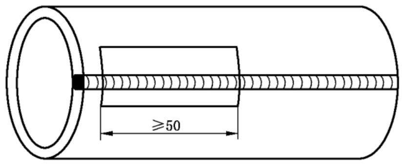  
图1 焊管舟形试样取样

单位为毫米

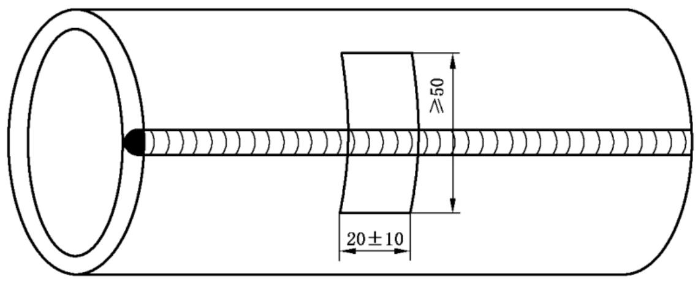  
图2 焊管弧形试样取样

单位为毫米

图3 焊条试样取样   
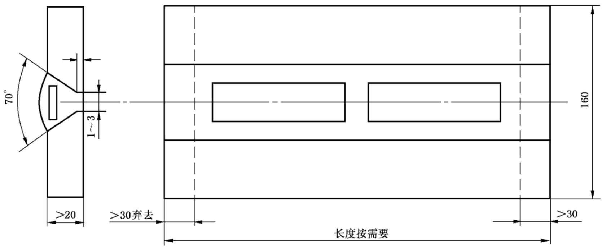  
注：采用与焊条相应钢号的钢板。

单位为毫米

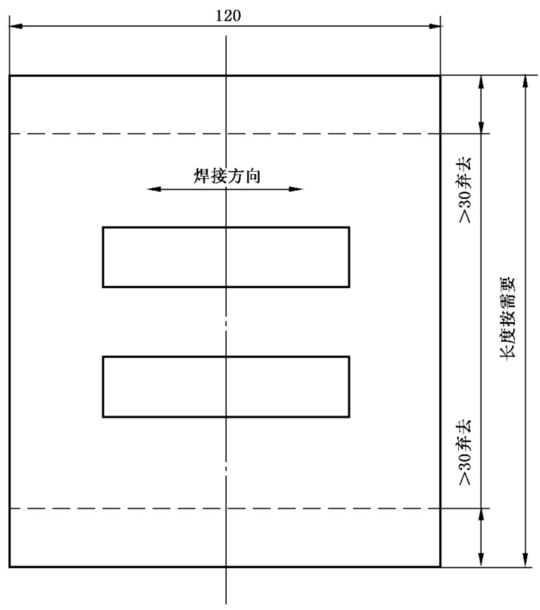

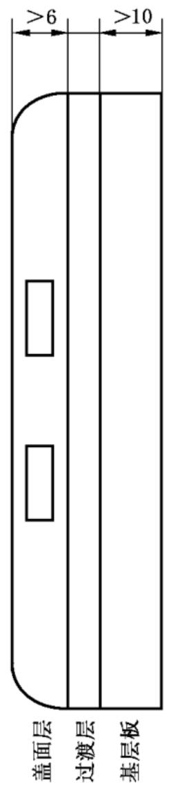  
注：基层板用与焊条相应钢号的钢板，试样长度方向沿着施焊方向。

图4堆焊焊条试样取样

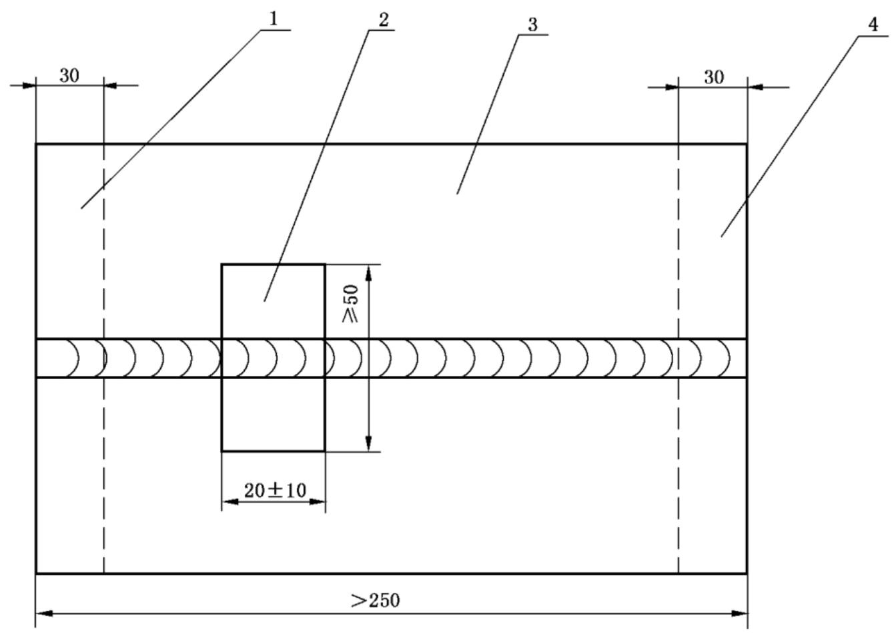  
图5 单焊缝取样

单位为毫米

# 说明：

1——弃去；  
2——焊接试样；  
3—焊板；  
1——弃去。

单位为毫米

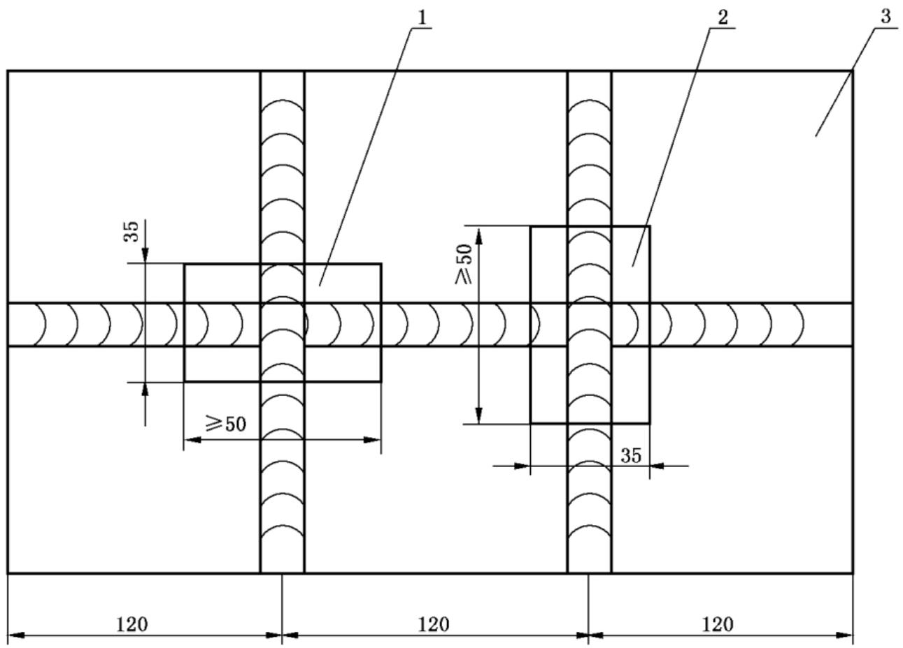  
图6 交叉焊缝取样

说明：

1——焊接试样；  
2——焊接试样；  
3—焊板。

# 3.2 试样的敏化处理

3.2.1 对于超低碳不锈钢(碳含量不大于 $0.030\%$ )和稳定化不锈钢(添加钛或铌)，在评价其本征晶间腐蚀敏感性时，试验前应对试样进行敏化处理，试样的敏化制度由供需双方协商确定。对于奥氏体不锈钢，推荐的敏化制度为 $650~\mathrm{^\circ C}\pm 10~\mathrm{^\circ C}$ ，保温 $2\textrm{h}$ ，空冷。对于双相不锈钢推荐的敏化制度为 $700~\mathrm{^\circ C}\pm$ $10~^\circ \mathrm{C},30\mathrm{min}$ ，水冷；也可采用 $650~\mathrm{^\circ C}\pm 10~\mathrm{^\circ C},10\mathrm{min}$ ，水冷。  
3.2.2 对于其他的不锈钢，试样是否需要敏化处理和采取何种敏化处理制度，由产品标准或供需双方协商确定。  
3.2.3 焊接试样一般以焊后状态进行试验。对焊后还要经过 $350^{\circ}\mathrm{C}$ 以上热加工的焊接件，试样应在焊后进行敏化处理。敏化处理制度由供需双方协商。  
3.2.4 试样的敏化处理应在研磨前进行。敏化前和试验前应用适当的溶剂或洗涤剂（非氯化物）对试样进行除油并干燥。

# 4 方法A $10\%$ 草酸浸蚀试验方法

# 4.1 试验溶液

4.1.1 将 $100\mathrm{g}$ 符合 $\mathrm{GB / T9854}$ 的优级纯草酸溶解于 $900~\mathrm{mL}$ 蒸馏水或去离子水中，配制成 $10\%$ 草酸溶液。  
4.1.2 对含钼钢在难以出现阶梯组织时，可以用 $100\mathrm{g}$ 符合GB/T655的分析纯过硫酸铵溶解于 $900~\mathrm{mL}$ 蒸馏水或去离子水中，配制成 $10\%$ 的过硫酸铵溶液代替 $10\%$ 的草酸溶液。

# 4.2 试验仪器和设备

4.2.1 供浸蚀试验用的直流电源、可变电阻器、选用适当量程的电流表（精度0.5级）。  
4.2.2 阴极为奥氏体不锈钢制成的钢杯或表面积足够大的不锈钢钢片，阳极为试样，如用不锈钢钢片作阴极时要采用适当形状的夹具，使试样保持于试验溶液中，浸蚀电路见图7。

# 4.3 试验条件和步骤

4.3.1 把浸蚀试样作阳极，以不锈钢钢杯或不锈钢钢片作为阴极，倒入 $10\%$ 草酸溶液，接通电流。阳极电流密度为 $1\mathrm{A} / \mathrm{cm}^2$ ，浸蚀时间 $90~\mathrm{s}$ ，浸蚀溶液温度 $20^{\circ}\mathrm{C}\sim 50^{\circ}\mathrm{C}$ 。用 $10\%$ 过硫酸铵浸泡时，电流密度为 $1\mathrm{A} / \mathrm{cm}^2$ ，浸蚀时间 $5\mathrm{min}\sim 10\mathrm{min}$ 。  
4.3.2 试样浸蚀后，用流水洗净，干燥。在金相显微镜下观察试样的全部浸蚀表面，放大倍数为200倍 $\sim 500$ 倍，根据表3、表4和图 $8\sim$ 图14判定组织的类别。  
4.3.3 每次试验使用新的溶液。

# 4.4 浸蚀组织的分类

4.4.1 显示晶界形态浸蚀组织的分类见表3。  
4.4.2 显示凹坑形态浸蚀组织的分类见表4。  
4.4.3 $10\%$ 草酸浸蚀试验与其他试验方法的关系见表5、表6。

单位为毫米

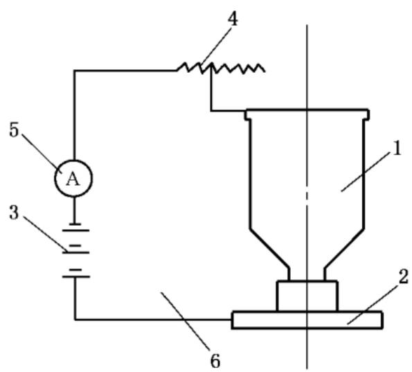  
a）大试样用

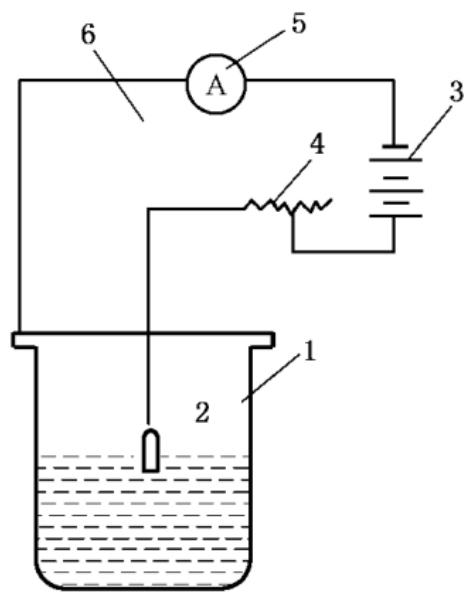  
b）小试样用  
图7电解浸蚀装置图

单位为毫米

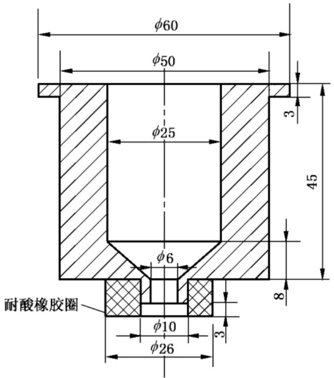  
图7（续）

c） 不锈耐酸钢容器

说明：

1——不锈钢容器；  
2——试样；  
3—直流电源；  
1——变阻器；  
5—电流表；  
6——开关。

表 3 晶界形态的分类  

<table><tr><td>类别</td><td>名称</td><td>组织特征</td></tr><tr><td>一类</td><td>阶梯组织</td><td>晶界无腐蚀沟,晶粒间呈台阶状;见图8</td></tr><tr><td>二类</td><td>混合组织</td><td>晶界有腐蚀沟,但没有一个晶粒被腐蚀沟包围;见图9</td></tr><tr><td>三类</td><td>沟状组织</td><td>晶界有腐蚀沟,个别或全部晶粒被腐蚀沟包围;见图10</td></tr><tr><td>四类</td><td>游离铁素体组织</td><td>铸钢件及焊接接头晶界无腐蚀沟,铁素体被显现;见图11</td></tr><tr><td>五类</td><td>连续沟状组织</td><td>铸钢件及焊接接头,沟状组织很深,并形成连续沟状组织;见图12</td></tr></table>

表 4 凹坑形态的分类  

<table><tr><td>类别</td><td>名称</td><td>组织特征</td></tr><tr><td>六类</td><td>凹坑组织Ⅰ</td><td>浅凹坑多,深凹坑少的组织;见图13</td></tr><tr><td>七类</td><td>凹坑组织Ⅱ</td><td>浅凹坑少,深凹坑多的组织;见图14</td></tr></table>

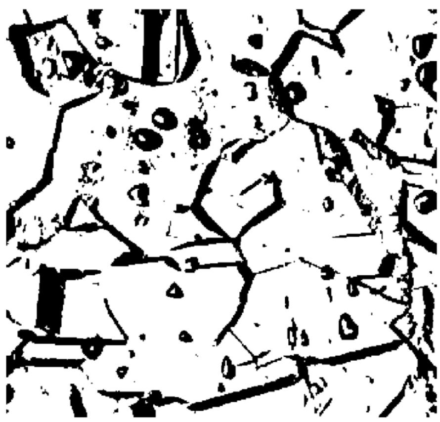  
图8 阶梯组织（一类） $500\times$

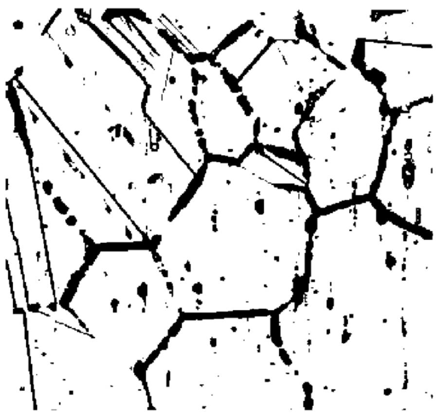  
图9 混合组织（二类） $500\times$

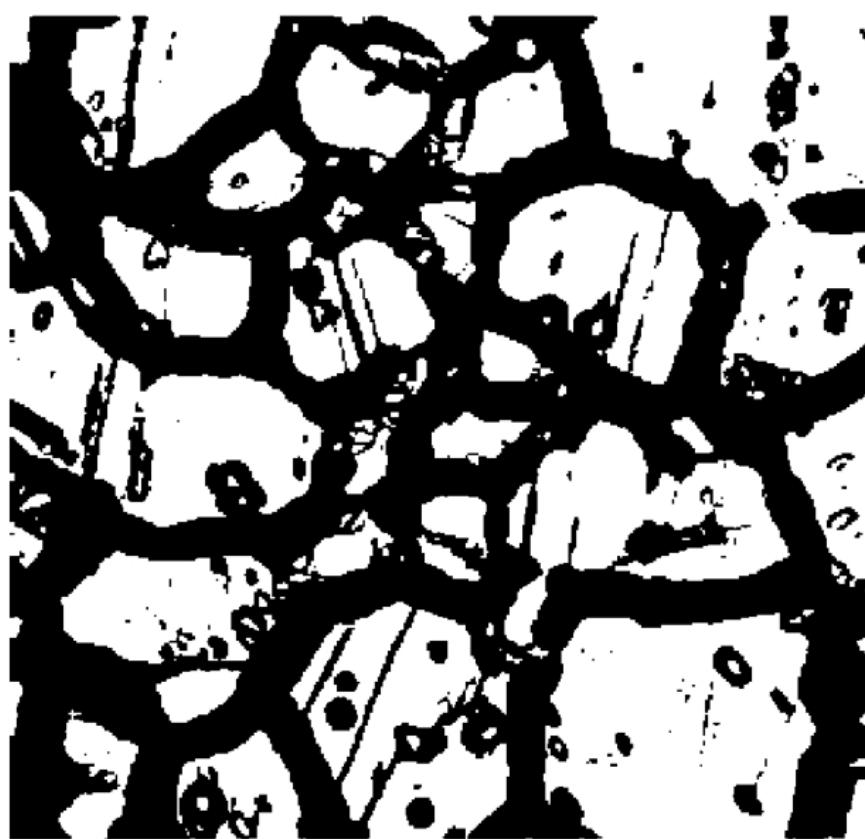

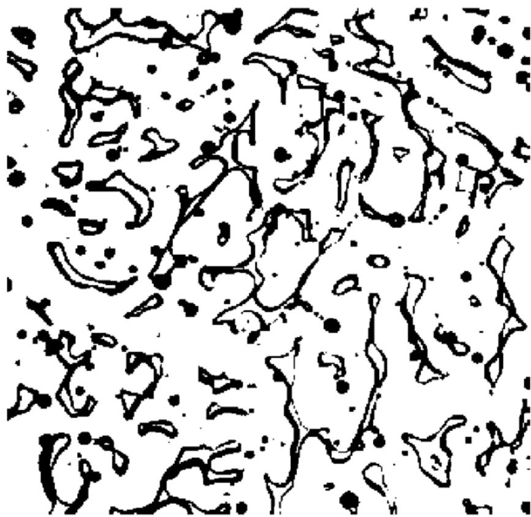  
图10 沟状组织（三类） $500\times$   
图11 游离铁素体组织（四类） $250\times$

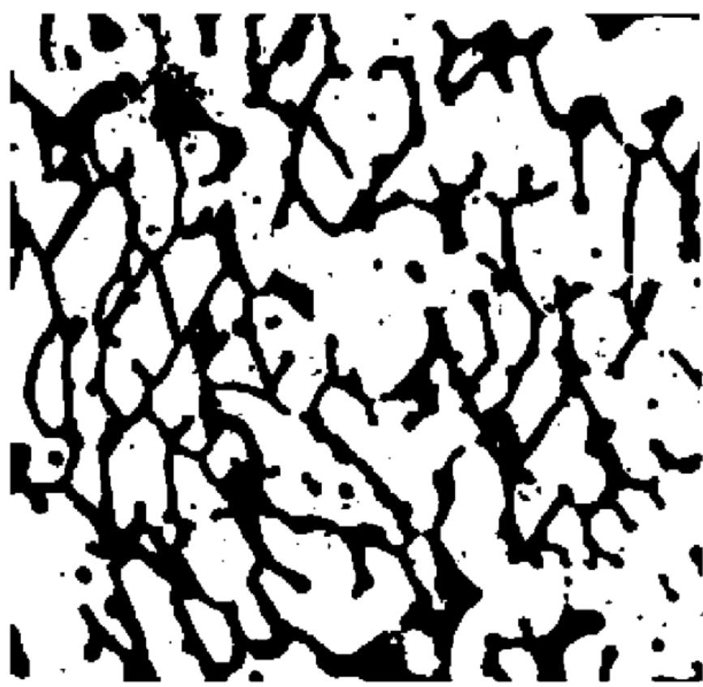

图12 连续沟状组织（五类） $250\times$

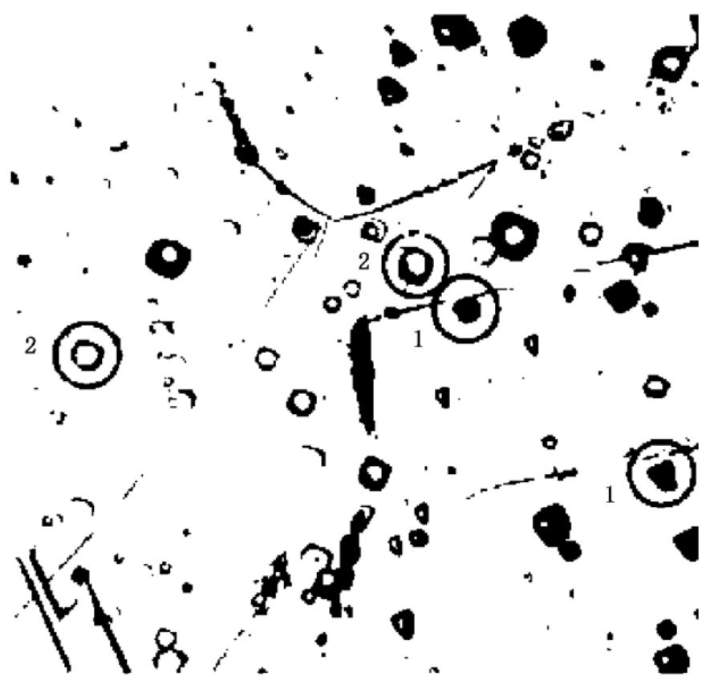  
图13 凹坑组织（六类） $500\times$

说明：

1——深凹坑；  
2——浅凹坑。

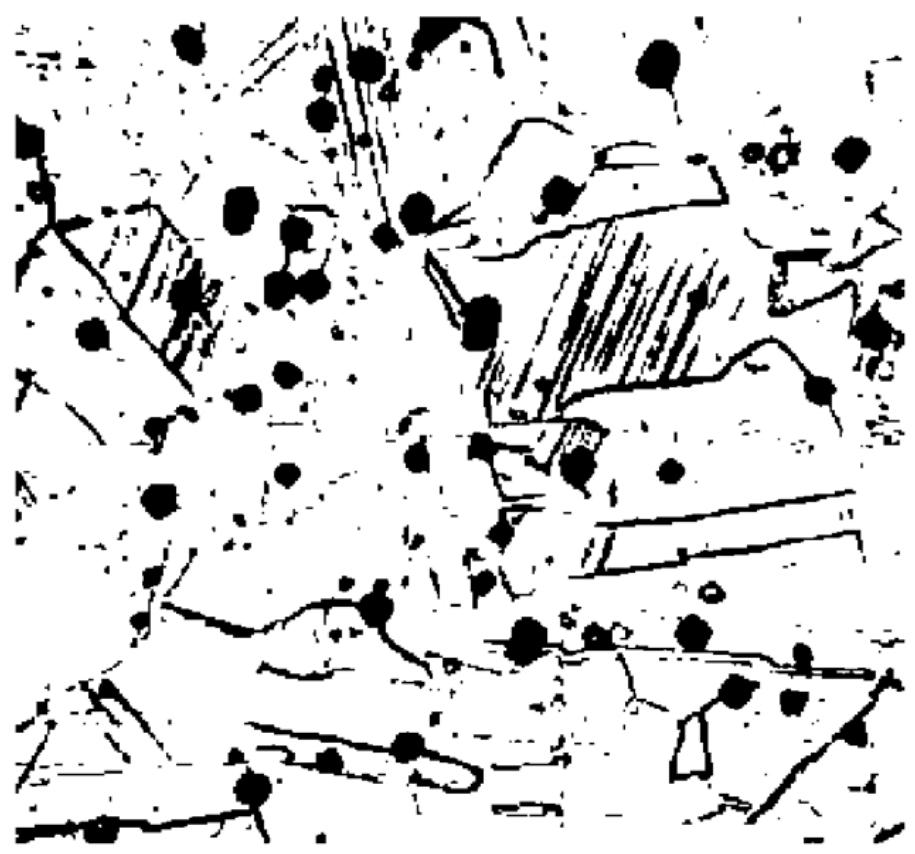  
图14 凹坑组织（七类） $500\times$

表 5 筛选试验与其他试验方法的关系  
表 6 方法 $\mathbf{A}$ 与热酸试验的关系  

<table><tr><td rowspan="2">类别</td><td colspan="5">压力加工试样</td><td colspan="5">铸件、焊接试样</td></tr><tr><td>方法B</td><td>方法C</td><td>方法E</td><td>方法F</td><td>方法G</td><td>方法B</td><td>方法C</td><td>方法E</td><td>方法F</td><td>方法G</td></tr><tr><td>一类</td><td>×</td><td>×</td><td>—</td><td>—</td><td>×</td><td>—</td><td>—</td><td>—</td><td>—</td><td>—</td></tr><tr><td>二类</td><td>×</td><td>×</td><td>—</td><td>—</td><td>×</td><td>—</td><td>—</td><td>—</td><td>—</td><td>—</td></tr><tr><td>三类</td><td>○</td><td>○</td><td>—</td><td>—</td><td>○</td><td>—</td><td>—</td><td>—</td><td>—</td><td>—</td></tr><tr><td>四类</td><td>—</td><td>—</td><td>×</td><td>×</td><td>—</td><td>×</td><td>×</td><td>×</td><td>×</td><td>×</td></tr><tr><td>五类</td><td>—</td><td>—</td><td>○</td><td>○</td><td>—</td><td>○</td><td>○</td><td>○</td><td>○</td><td>○</td></tr><tr><td>六类</td><td>×</td><td>×</td><td>×</td><td>×</td><td>×</td><td>×</td><td>×</td><td>×</td><td>×</td><td>×</td></tr><tr><td>七类</td><td>×</td><td>○</td><td>×</td><td>×</td><td>×</td><td>×</td><td>○</td><td>×</td><td>×</td><td>×</td></tr><tr><td colspan="11">注:×表示不必做其他方法试验;○表示要做其他方法试验;—表示不做该试验。</td></tr></table>

<table><tr><td>热酸试验</td><td>用10%草酸浸蚀试验,判定是否需要做热酸试验的不锈钢钢种</td><td>用热酸试验检验铬碳化物或σ相与不锈钢种的关系</td></tr><tr><td>方法B</td><td>06Cr19Ni10、022Cr19Ni1006Cr17Ni12Mo2、022Cr17Ni12Mo206Cr18Ni12Mo2Cu2022Cr18Ni14Mo2Cu206Cr19Ni13Mo3、022Cr19Ni13Mo3</td><td>铬碳化物:06Cr19Ni10、022Cr19Ni1006Cr17Ni12Mo2、022Cr17Ni12Mo206Cr18Ni12Mo2Cu2、022Cr18Ni14Mo2Cu206Cr19Ni13Mo3、022Cr19Ni13Mo3</td></tr><tr><td>方法C</td><td>06Cr19Ni10、022Cr19Ni10</td><td>铬碳化物:06Cr19Ni10、022Cr19Ni10铬碳化物与σ相:06Cr18Ni12Mo2Cu2、022Cr18Ni14Mo2Cu2022Cr17Ni12Mo2、06Cr17Ni12Mo206Cr19Ni13Mo3、022Cr19Ni13Mo3、06Cr18Ni11Ti06Cr18Ni11Nb</td></tr><tr><td rowspan="6">方法E</td><td>06Cr18Ni9、022Cr19Ni10</td><td>铬碳化物:</td></tr><tr><td>06Cr17Ni12Mo2、022Cr17Ni12Mo2</td><td>06Cr18Ni9、022Cr19Ni10、06Cr17Ni12Mo2</td></tr><tr><td>06Cr18Ni12Mo2Cu2</td><td>022Cr17Ni12Mo2、06Cr18Ni12Mo2Cu2</td></tr><tr><td>022Cr18Ni14Mo2Cu2、06Cr19Ni13Mo3</td><td>022Cr18Ni14Mo2Cu2、06Cr19Ni13Mo3</td></tr><tr><td>022Cr19Ni13Mo3、06Cr18Ni10Ti</td><td>022Cr19Ni13Mo3、06Cr18Ni10Ti</td></tr><tr><td>06Cr18Ni10Ti</td><td>0Cr18Ni10Ti</td></tr></table>

# 4.5 试验报告

试验报告应包括以下内容：

a）本标准编号及名称；  
b）试验方法；  
c）试样的名称及试验面积尺寸；  
d）电流密度；  
e）浸蚀时间和温度；  
f）浸蚀后的金相照片；  
g）判定结果。

# 5 方法B $50\%$ 硫酸-硫酸铁腐蚀试验方法

# 5.1 试验溶液

5.1.1 将 $236~\mathrm{mL}$ 符合 $\mathrm{GB / T625}$ 的优级纯硫酸缓缓加入盛有 $400~\mathrm{mL}$ 蒸馏水的锥形瓶中配制成 $50\%$ $(49.4\% \sim 50.9\%)$ 硫酸溶液（注意防止暴沸）。  
5.1.2 称取 $25\mathrm{g}$ 水合硫酸铁 $\left[\mathrm{Fe}_{2}(\mathrm{SO}_{4})_{3} \cdot x \mathrm{H}_{2} \mathrm{O}\right]$ ，硫酸铁约 $75\%$ （质量分数）加入上述硫酸溶液中。  
5.1.3 为防止暴沸，推荐将纯三氧化二铝制成的碎屑加入试验溶液中。  
5.1.4 连接烧瓶与冷凝器并通上冷却水，加热使溶液沸腾，直到硫酸铁全部溶解。  
5.1.5 操作时应保护好眼睛并佩戴防护手套。将试验用烧瓶置于通风柜中。

# 5.2 试验仪器和设备

5.2.1 推荐使用容量为 $1\mathrm{L}$ 带回流冷凝器的磨口锥形烧瓶。  
5.2.2 使试验溶液能保持微沸状态的加热装置。  
5.2.3 精度不低于 $0.02\mathrm{mm}$ 的游标卡尺。

# 5.3 试验条件和步骤

5.3.1 测量试样的尺寸，计算试样的表面积（取3位有效数字）。  
5.3.2 试验前对试样进行称重（精确到 $1\mathrm{mg}$ ）。  
5.3.3 溶液量按试样表面积计算，其量不少于 $20~\mathrm{mL} / \mathrm{cm}^2$   
5.3.4 试样放在试验溶液中用玻璃支架保持于溶液中部，连续煮沸 $120\mathrm{h}$ 。每一容器中只放一个试样。  
5.3.5 通常试验中不需要更换溶液，但要注意尽可能减少溶液的挥发。溶液开始沸腾时，在瓶体上标

记液面位置，以检查溶液的挥发程度。如果液面位置发生了明显变化，则需要更换新的溶液并使用新的试样或重新打磨过的试样进行试验。

5.3.6 试验中间若有需要，可取出试样进行称量，然后继续试验。  
5.3.7 试验期间，试验溶液应无明显颜色变化。若试样腐蚀过快，甚至由此导致溶液颜色明显由黄色变为绿色，则需要在试验过程中加入更多的硫酸铁。通过中间称量，如果试样总质量的消耗达到了 $2\mathrm{g}$ ，则试样质量每消耗 $1\mathrm{g}$ 需要加入 $10\mathrm{g}$ 硫酸铁。  
5.3.8 试验后取出试样，在流水中用软刷子刷掉表面的腐蚀产物，洗净、干燥、称重。  
5.3.9 每次试验用新的溶液。

# 5.4 试验结果评定

以腐蚀速率评定试验结果，腐蚀速率按式(1)计算，单位为克每平方米每小时 $\left[\mathrm{g} / \left(\mathrm{m}^{2} \cdot \mathrm{h}\right)\right]$ ，计算结果按GB/T8170进行数值修约，修约到小数点后第二位。

$$
\text {腐 蚀 速 率} = \frac {W _ {\text {前}} - W _ {\text {后}}}{S \times t} \tag {1}
$$

式中：

$W_{\text{前}}$ ——试验前试样质量，单位为克 $(\mathrm{g})$ ；

$W_{\text{后}}$ ——试验后试样质量，单位为克 $(\mathrm{g})$ ；

$S$ ——试样总面积，单位为平方米 $(\mathrm{m}^2)$ ；

$t$ ——试验时间，单位为小时（h）。

# 5.5 试验报告

试验报告应包括以下内容：

a）本标准编号及名称；  
b）试验方法；  
c）试样的名称及尺寸面积；  
d）如经过敏化处理应记录敏化处理制度；  
e）试验时间；  
f）试验前后试样质量；  
g）试样的腐蚀速率 $\left[\mathrm{g} / \left(\mathrm{m}^{2}\bullet \mathrm{h}\right)\right]$

# 6 方法C $65\%$ 硝酸腐蚀试验方法

# 6.1 试验溶液

将符合GB/T626的优级纯硝酸用蒸馏水或去离子水配制成为 $65.0\% \pm 0.2\%$ （质量分数)的硝酸溶液 $(\rho_{20} = 1.40~\mathrm{g / mL})$ 。

# 6.2 试验仪器和设备

同5.2。

# 6.3 试验条件和步骤

6.3.1 测量试样的尺寸、计算试样的表面积（取3位有效数字）。  
6.3.2 试验前对试样进行称重（精确到 $1\mathrm{mg}$ ）。  
6.3.3 试样放在试验溶液中用玻璃支架保持于溶液中部。溶液量按试样表面积计算，其量不少于

$20~\mathrm{mL} / \mathrm{cm}^2$ 。每周期应用新的试验溶液。每一容器中只放一个试样。

6.3.4 对于常规检验，在同一容器中可试验两个试样，但这两个试样应是同一规格、同一炉号和同一热处理制度，如果两个试样中有一个未能通过试验，按6.3.3重新试验。  
6.3.5 试验5个周期，每周期连续煮沸 $18\mathrm{h}$ 。试验后取出试样，在流水中用软刷子刷掉表面的腐蚀产物，洗净、干燥、称重。根据供需双方协商，也可使用其他周期次数进行试验。  
6.3.6 每次试验用新的溶液。

# 6.4 试验结果评定

以腐蚀速率评定试验结果，腐蚀速率按式(1)计算。计算结果按GB/T8170进行数值修约，修约到小数点后第二位。然后计算各个周期的平均值。焊接试样发现刀状腐蚀即为具有晶间腐蚀倾向，如有异议，可用金相法判定。

# 6.5 试验报告

试验报告应包括下列内容：

a）本标准编号及名称；  
b）试验方法；  
c）试样的名称及尺寸面积；  
d）如经过敏化处理应记录敏化处理制度；  
e）试验时间；  
f）试验前后试样质量；  
g）每个试样各周期的试验时间长及腐蚀速率 $\left[\mathrm{g} / \left(\mathrm{m}^{2}\cdot \mathrm{h}\right)\right]$ ，以及各周期腐蚀速率的平均值。

# 7 方法E 铜-硫酸铜- $16\%$ 硫酸腐蚀试验方法

# 7.1 试验溶液

将 $100\mathrm{g}$ 符合 $\mathrm{GB / T665}$ 的分析纯硫酸铜 $(\mathrm{CuSO}_4\cdot 5\mathrm{H}_2\mathrm{O})$ 溶解于 $700~\mathrm{mL}$ 蒸馏水或去离子水中，再加入 $100~\mathrm{mL}$ 符合 $\mathrm{GB / T625}$ 的优级纯硫酸，用蒸馏水或去离子水稀释至 $1000~\mathrm{mL}$ ，配制成 $16\%$ 硫酸-硫酸铜溶液。

# 7.2 试验仪器和设备

7.2.1 推荐使用容量为 $1\mathrm{L}$ 带回流冷凝器的磨口锥形烧瓶。  
7.2.2 使试验溶液能保持微沸状态的加热装置。

# 7.3 试验条件和步骤

7.3.1 试验前将试样用适当的溶剂或洗涤剂(非氯化物)除油并干燥。  
7.3.2 在烧瓶底部铺一层纯度不小于 $99.5\%$ 的铜屑、铜粒或碎铜片，然后放置试样。保证每个试样与铜屑接触的情况下，同一烧瓶中允许放置一个以上同一钢种的试样，试样之间要互不接触。

注：使用碎铜片时注意防止溶液暴沸。

7.3.3 试验溶液量按试样表面积计算，其量不少于 $8\mathrm{mL} / \mathrm{cm}^2$ 。试验溶液应高出试样 $20\mathrm{mm}$ 以上。每次试验都应使用新的试验溶液。  
7.3.4 将烧瓶放在加热装置上，通以冷却水，加热试验溶液，使之保持微沸状态。试验连续 $20\mathrm{h}\pm 5\mathrm{h}$ ，如有争议，应采用 $20\mathrm{h}$ 。  
7.3.5 试验后取出试样，洗净、干燥、弯曲。

# 7.3.6 每次试验用新的溶液。

# 7.4 试验结果评定

7.4.1 压力加工件试样弯曲角度为 $180^{\circ}$ 。铸钢件、焊管和焊接件弯曲角度不小于 $90^{\circ}$ ，焊管舟形试样沿垂直焊缝方向进行弯曲，焊接接头沿熔合线进行弯曲。对于低韧性的材料，可以采用一个未经试验的试样确定其不发生开裂的最大弯曲角度，以此作为弯曲试验的弯曲角度。  
7.4.2 对于压力加工件，试样弯曲用的压头直径应不大于试样厚度的2倍；对于铸钢件、焊管和焊接件，试样弯曲用的压头直径应不大于试样厚度的4倍。  
7.4.3 对于直径不大于 $15\mathrm{mm}$ 的整管试样，采用压扁试验评定时，两压板之间的距离 $H$ ，按式（2）计算：

$$
H = \frac {1 . 0 9 D t}{0 . 0 9 D + t} \tag {2}
$$

式中：

$t$ ——试样厚度，单位为毫米（ $\mathrm{mm}$ ）；

$D$ ——试样外径，单位为毫米（ $\mathrm{mm}$ ）。

7.4.4 弯曲后的试样在 $10\times$ 放大镜下观察试样表面是否有因晶间腐蚀而产生的裂纹。从试样的弯曲部位棱角产生的裂纹，以及不伴有裂纹的滑移线、皱纹和表面粗糙等都不能认为是晶间腐蚀而产生的裂纹。  
7.4.5 试样不能进行弯曲评定或弯曲的裂纹难以判定时，则采用金相法。金相磨片应取自试样的非弯曲部位（焊接接头和焊管除外），经浸蚀后（不得过腐蚀），在显微镜下观察 $(150\times \sim 500\times)$ ，允许的晶间腐蚀深度由供需双方协商确定。

注：如果怀疑裂纹是由于弯曲产生的裂纹，可对一未经过腐蚀试验的试样进行同样的弯曲，弯曲后进行比较，便可以认定在腐蚀试验试样上看到的裂纹是否是由于晶间腐蚀造成的。

# 7.5 试验报告

试验报告应包括以下内容：

a）本标准编号及名称；  
b）试验方法；  
c）试样的名称及尺寸面积；  
d）如经过敏化处理应记录敏化处理制度；  
e）试验时间；  
f）试样弯曲角度及 $10\times$ 放大镜观察后，晶间腐蚀倾向结果；  
g）如果用金相法判定时，应记录放大倍数及晶间腐蚀深度。

# 8 方法F 铜-硫酸铜- $35\%$ 硫酸腐蚀试验方法

# 8.1 试验溶液

将 $250~\mathrm{mL}$ 符合GB/T625的优级纯硫酸加入 $750\mathrm{mL}$ 蒸馏水或去离子水中，再加入 $110\mathrm{g}$ 符合GB/T665的分析纯硫酸铜 $(\mathrm{CuSO}_4\cdot 5\mathrm{H}_2\mathrm{O})$ ，配制成 $35\%$ 硫酸-硫酸铜溶液。

# 8.2 试验仪器和设备

同7.2。

# 8.3 试验条件和步骤

8.3.1 试验前将试样用适当的溶剂或洗涤剂(非氯化物)除油并干燥。  
8.3.2 在烧瓶底部铺一层纯度不小于 $99.5\%$ 的铜屑、铜粒或碎铜片，然后放置试样。保证每个试样与铜屑接触的情况下，同一烧瓶中允许放置一个以上同一钢种的试样，试样之间要互不接触。

注：使用碎铜片时注意防止溶液暴沸。

8.3.3 试验溶液量按试样表面积计算，其量不少于 $10\mathrm{mL} / \mathrm{cm}^2$ 。试验溶液应高出试样 $20\mathrm{mm}$ 以上。每次试验都应使用新的试验溶液。  
8.3.4 将烧瓶放在加热装置上，通以冷却水，加热试验溶液，使之保持微沸状态。试验连续 $20\mathrm{h}\pm 5\mathrm{h}$ 如有争议，应采用 $20\mathrm{h}$   
8.3.5 试验后取出试样，洗净、干燥、弯曲。  
8.3.6 每次试验用新的溶液。

# 8.4 试验结果评定

8.4.1 试样弯曲角度不小于 $90^{\circ}$ ，焊管舟形试样沿垂直焊缝方向进行弯曲，焊接接头沿熔合线进行弯曲。对于低韧性的材料，可以采用一个未经试验的试样确定其不发生开裂的最大弯曲角度，以此作为弯曲试验的弯曲角度。  
8.4.2 对于压力加工件，试样弯曲用的压头直径应不大于试样厚度的2倍；对于铸钢件、焊管和焊接件，试样弯曲用的压头直径应不大于试样厚度的4倍。  
8.4.3 对于直径不大于 $15\mathrm{mm}$ 的整管试样，采用压扁试验评定时，两压板之间的距离 $H$ ，按式(2)计算。  
8.4.4 弯曲后的试样在 $10\times$ 放大镜下观察弯曲试样外表面是否有因晶间腐蚀而产生的裂纹。从试样的弯曲部位棱角产生的裂纹，以及不伴有裂纹的滑移线、皱纹和表面粗糙等都不能认为是晶间腐蚀而产生的裂纹。  
8.4.5 试样不能进行弯曲评定或弯曲的裂纹难以判定时，则采用金相法。金相磨片应取自试样的非弯曲部位（焊接接头和焊管除外），经浸蚀后（不得过腐蚀），在显微镜下观察 $(150\times \sim 500\times)$ ，允许的晶间腐蚀深度由供需双方协商确定。

注：如果怀疑裂纹是由于弯曲产生的裂纹，可对一未经过腐蚀试验的试样进行同样的弯曲，弯曲后进行比较，便可以认定在腐蚀试验试样上看到的裂纹是否是由于晶间腐蚀造成的。

# 8.5 试验报告

同7.5。

# 9 方法G $40\%$ 硫酸-硫酸铁腐蚀试验方法

# 9.1 试验溶液

将 $280~\mathrm{mL}$ 符合GB/T625的优级纯硫酸加入 $720~\mathrm{mL}$ 蒸馏水或去离子水中，再称取 $25\mathrm{g}$ 水合硫酸铁 $\left[\mathrm{Fe}_{2}(\mathrm{SO}_{4})_{3}\cdot x\mathrm{H}_{2}\mathrm{O}\right]$ ，硫酸铁约 $75\%$ （质量分数）加入上述硫酸溶液中，配制成 $40\%$ 硫酸-硫酸铁溶液。

# 9.2 试验仪器和设备

同7.2。

# 9.3 试验条件和步骤

同8.3。

# 9.4 试验结果评定

同8.4。

# 9.5 试验报告

同7.5。

# 附录A

# （资料性附录）

本标准与ISO3651-1:1998和ISO3651-2:1998相比结构变化情况

本标准与ISO3651-1：1998和ISO3651-2：1998相比在结构上有较多调整，具体章条编号对照情况见表A.1。

表A.1 本标准与ISO3651-1:1998和ISO3651-2:1998的章条编号对照情况  

<table><tr><td>本标准章条编号</td><td>对应的 ISO 3651-1:1998 章条编号</td><td>对应的 ISO 3651-2:1998 章条编号</td></tr><tr><td>1</td><td>1</td><td>1</td></tr><tr><td>2</td><td>—</td><td>—</td></tr><tr><td>3</td><td>—</td><td>—</td></tr><tr><td>3.1</td><td>4.2</td><td>4.2</td></tr><tr><td>3.2</td><td>3</td><td>3</td></tr><tr><td>4</td><td>—</td><td>—</td></tr><tr><td>5</td><td>—</td><td>—</td></tr><tr><td>6</td><td>—</td><td>—</td></tr><tr><td>6.1</td><td>6</td><td>—</td></tr><tr><td>6.2</td><td>5</td><td>—</td></tr><tr><td>6.3</td><td>7</td><td>—</td></tr><tr><td>6.4</td><td>8</td><td>—</td></tr><tr><td>6.5</td><td>9</td><td>—</td></tr><tr><td>7</td><td>—</td><td>6.1</td></tr><tr><td>7.1</td><td>—</td><td>6.1.1</td></tr><tr><td>7.2</td><td>—</td><td>5</td></tr><tr><td>7.3</td><td>—</td><td>6.1.2</td></tr><tr><td>7.4</td><td>—</td><td>7</td></tr><tr><td>7.5</td><td>—</td><td>8</td></tr><tr><td>8</td><td>—</td><td>6.2</td></tr><tr><td>8.1</td><td>—</td><td>6.2.1</td></tr><tr><td>8.2</td><td>—</td><td>5</td></tr><tr><td>8.3</td><td>—</td><td>6.2.2</td></tr><tr><td>8.4</td><td>—</td><td>7</td></tr><tr><td>8.5</td><td>—</td><td>8</td></tr><tr><td>9</td><td>—</td><td>6.3</td></tr><tr><td>9.1</td><td>—</td><td>6.3.1</td></tr><tr><td>9.2</td><td>—</td><td>5</td></tr><tr><td>9.3</td><td>—</td><td>6.3.2</td></tr><tr><td>9.4</td><td>—</td><td>7</td></tr><tr><td>9.5</td><td>—</td><td>8</td></tr><tr><td>附录 A</td><td>—</td><td>—</td></tr><tr><td>附录 B</td><td>—</td><td>—</td></tr><tr><td>附录 C</td><td>—</td><td>—</td></tr><tr><td>附录 D</td><td>—</td><td>附录 A</td></tr></table>

# 附录B

# （资料性附录）

本标准与ISO3651-1:1998和ISO3651-2:1998的技术性差异及其原因

表B.1给出了本标准与ISO3651-1:1998和ISO3651-2:1998的技术性差异及其原因。

表 B.1 本标准与 ISO 3651-1:1998 和 ISO 3651-2:1998 的技术性差异及其原因  

<table><tr><td>本标准章条编号</td><td>技术性差异</td><td>原因</td></tr><tr><td>2</td><td>增加了第2章规范性引用文件</td><td>国际标准无规范性引用文件,但是标准文本中引用了其他标准,根据我国标准要求,增加了第二章规范性引用文件</td></tr><tr><td>4</td><td>增加了方法A:10%草酸浸蚀试验方法</td><td>我国有实验室使用该方法</td></tr><tr><td>5</td><td>增加了方法B:50%硫酸-硫酸铁腐蚀试验方法</td><td>我国有实验室使用该方法</td></tr><tr><td>附录A</td><td>增加了附录A 本标准与ISO 3651-1:1998和ISO 3651-2:1998相比结构变化情况</td><td>适应我国标准编写要求</td></tr><tr><td>附录B</td><td>增加了附录B 本标准与ISO 3651-1:1998和ISO 3651-2:1998的技术性差异及其原因</td><td>适应我国标准编写要求</td></tr><tr><td>附录C</td><td>增加了附录C 本标准各试验方法及其特点</td><td>对各方法的特点进行总结,以便用户选择</td></tr></table>

# 附录C

# （资料性附录）

# 本标准各试验方法及其特点

本标准各试验方法及其特点见表C.1。

表 C.1 本标准各试验方法及其特点  

<table><tr><td>试验方法</td><td>适用钢种</td><td>试验溶液</td><td>推荐时间</td><td>主要评价方法</td></tr><tr><td>方法A</td><td>奥氏体不锈钢</td><td>10%草酸</td><td>90s</td><td>金相法</td></tr><tr><td>方法B</td><td>奥氏体不锈钢</td><td>50%硫酸-硫酸铁</td><td>120h</td><td>失重法</td></tr><tr><td>方法C</td><td>奥氏体不锈钢</td><td>65%硝酸</td><td>48h/周期×5周期</td><td>失重法</td></tr><tr><td>方法E</td><td>奥氏体不锈钢、双相不锈钢</td><td>铜-硫酸铜-16%硫酸</td><td>20h</td><td>弯曲法或金相法</td></tr><tr><td>方法F</td><td>奥氏体不锈钢、双相不锈钢</td><td>铜-硫酸铜-35%硫酸</td><td>20h</td><td>弯曲法或金相法</td></tr><tr><td>方法G</td><td>奥氏体不锈钢、双相不锈钢</td><td>40%硫酸-硫酸铁</td><td>20h</td><td>弯曲法或金相法</td></tr></table>

# 附录D

# （资料性附录）

方法E、方法F和方法G适用范围

表D.1给出了方法E、方法F、方法G的适用范围。对同一钢种可采用一种以上的试验方法。

表 D. 1 方法 E、方法 F、方法 G 适用范围  

<table><tr><td rowspan="2">试验方法</td><td rowspan="2">试验溶液</td><td colspan="2">奥氏体不锈钢</td><td colspan="2">双相不锈钢</td></tr><tr><td>Cr/%</td><td>Mo/%</td><td>Cr/%</td><td>Mo/%</td></tr><tr><td>E法</td><td>铜-硫酸铜-16%硫酸</td><td>&gt;16</td><td>≤3</td><td>&gt;16</td><td>≤3</td></tr><tr><td>F法</td><td>铜-硫酸铜-35%硫酸</td><td>&gt;20</td><td>2~4</td><td>&gt;20</td><td>&gt;2</td></tr><tr><td rowspan="2">G法</td><td rowspan="2">40%硫酸-硫酸铁</td><td>&gt;17</td><td>&gt;3</td><td rowspan="2">&gt;20</td><td rowspan="2">≥3</td></tr><tr><td>&gt;25</td><td>&gt;2</td></tr></table>